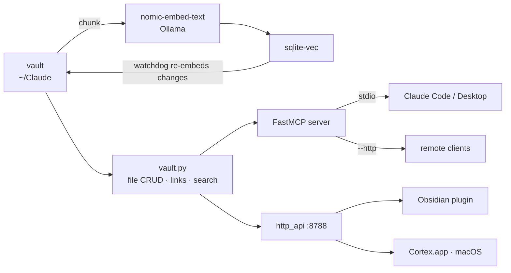

<div align="center">

# 🧠 Cortex

**The local-first brain for your notes — one MCP server that gives every LLM client your entire Obsidian vault.**

[](LICENSE)
[](#requirements)
[](#connect-it-to-an-mcp-client)
[]()
[](https://ollama.com)
[](https://github.com/asg017/sqlite-vec)
[](https://github.com/Gustav-Proxi/cortex/releases)


</div>

> **"Obsidian is the IDE; the LLM is the programmer; the wiki is the codebase."**
> — Andrej Karpathy, [*LLM Wiki*](https://gist.github.com/karpathy/442a6bf555914893e9891c11519de94f) (2026)

Karpathy's point: a markdown knowledge base only stays alive if something tireless maintains it — *"the tedious part of maintaining a knowledge base is not the reading or the thinking — it's the bookkeeping. The LLM handles that."* **Cortex is the engine that makes that real**, and it exposes the whole vault over **MCP** so *every* LLM surface (Claude Code, Desktop, agents) shares one brain — not just a single app.

## What it does

Cortex turns a folder of markdown (your Obsidian vault) into something an LLM can actually *use*:

- 🔎 **Search** — semantic (local embeddings), literal (grep), and **hybrid** (keyword ⊕ vector); plus frontmatter/property filters and the `[[wikilink]]` graph (`backlinks` / `outgoing_links`).
- ✍️ **Read & write** — full note CRUD, frontmatter, templates, daily notes. The LLM can *file answers back into the wiki*, so knowledge **compounds** instead of vanishing into chat history.
- 📚 **Research helpers** — DOI/arXiv → APA + BibTeX, deadline extraction from your notes, unlinked-neighbour suggestions.
- 🕸️ **Graph intelligence** — shortest path between notes, "god nodes" (hubs), topical communities, and **semantic bridges** (notes that read as related but aren't `[[linked]]`); export to mermaid/cypher/graphml.
- 📎 **Beyond markdown** — point `CORTEX_EXTRA_ROOTS` at a papers folder or a project's codebase and Cortex indexes **PDFs and source code** too, searchable alongside your notes.
- ⚡ **Always current** — a background watcher re-embeds changed notes within ~2 s; the index is a single sqlite file.

It reads and writes the vault's markdown **directly** — no Obsidian process, no HTTP bridge, no bearer token. Nothing leaves the machine: embeddings run locally via Ollama.

## Why it's different

|  | **Cortex** | Plain RAG | In-Obsidian plugins |
|---|---|---|---|
| **Works in** | every MCP client (Code, Desktop, agents) | one app/integration | Obsidian only |
| **Reads *and writes*** | ✅ full CRUD — knowledge compounds | ❌ retrieval only | partial |
| **Privacy** | 🔒 100% local (Ollama) | often cloud | varies |
| **Moving parts** | one sqlite file + one process | vector DB + service | Obsidian + plugin |
| **Beyond retrieval** | maintains the wiki (links, files, prunes) | re-searches every query | manual |

The point isn't "search your notes." It's a **persistent, compounding** knowledge layer the LLM maintains for you — reachable everywhere through one open protocol.

## Architecture

The one-way pipeline that keeps search current:



One engine, three clients: Claude over MCP, and the Obsidian plugin + the native macOS app over the loopback JSON API.

## Design choices

| Concern | Choice | Why |
|---|---|---|
| Embeddings | `nomic-embed-text` via Ollama | 768-dim, strong, **fully local**, fast on M-series. Vault text never leaves the Mac. |
| Vector store | **sqlite-vec** | Single file, no server, no Docker. |
| Server | **FastMCP** | stdio for local Claude; `--http` for remote later. |
| Sync | **watchdog** | Re-embeds only changed notes, prunes deleted ones. |
| Files | **direct disk I/O** (`vault.py`) | No Obsidian process needed — read/write markdown straight, with path-safety. |

## Location

The repo lives at **`~/cortex`** — deliberately **outside `~/Documents`**, which
macOS syncs to iCloud. A 2,500-file venv in an iCloud folder triggers an upload
storm and `EDEADLK` lock-contention crashes; keeping Cortex in `~/` avoids it.
The index (`~/.cortex/index.db`) is also outside the vault so it never indexes
itself.

## Requirements

| Need | Minimum | Notes |
|---|---|---|
| OS | macOS 13+ (Apple Silicon) | Works on Linux too; only the `launchd` auto-start is macOS-specific (use `systemd`/`cron` elsewhere). |
| Python | 3.10+ | The installer creates a repo-local `.venv`. |
| [Ollama](https://ollama.com) | running locally | Serves the embedding model. Nothing leaves the machine. |
| Embedding model | `nomic-embed-text` (768-dim) | `ollama pull nomic-embed-text`. Any Ollama embed model works if you also set `CORTEX_EMBED_DIM` to match. |
| A markdown folder | an Obsidian vault, or any dir of `.md` | Pointed to by `CORTEX_VAULT`. Obsidian itself does **not** need to be running. |
| An MCP client | Claude Code, Claude Desktop, or any MCP-capable client | This is what *connects* to Cortex (see [Connect it to an MCP client](#connect-it-to-an-mcp-client)). |
| Disk | a few hundred MB | the venv + the sqlite index at `~/.cortex/index.db`. |

Python deps (installed automatically by `pip install -e .`): `sqlite-vec`, `mcp`, `watchdog`, `pyyaml`, `ruamel.yaml`.

## Install (macOS, Apple Silicon)

```bash
cd ~/cortex
CORTEX_VAULT="$HOME/Claude" bash install.sh
```

Installs Ollama + the model, makes a venv, builds the first index. Manual:

```bash
brew install ollama && brew services start ollama   # auto-starts on login
ollama pull nomic-embed-text
python3 -m venv .venv && ./.venv/bin/pip install -e .
CORTEX_VAULT="$HOME/Claude" ./.venv/bin/python -m cortex.index build
```

## CLI

```bash
./.venv/bin/python -m cortex.index search "what did I decide about baselines?"
./.venv/bin/python -m cortex.index build          # incremental (changed notes)
./.venv/bin/python -m cortex.index build --full   # rebuild everything
./.venv/bin/python -m cortex.index stats
```

## The MCP tools (33)

**Search & recall** — `semantic_search`, `related_notes`, `search_text` (grep),
`search_property` (frontmatter `status`/`type`/`domain`), `hybrid_search`
(keyword ⊕ vector), `search_filtered` (semantic *within* a property), `backlinks`,
`outgoing_links`
**Graph intelligence** — `graph_overview`, `graph_path` (shortest [[link]] path),
`graph_hubs` ("god nodes"), `graph_communities` (topical clusters),
`graph_bridges` (semantic-but-unlinked pairs), `graph_export` (mermaid/cypher/graphml/json)
**Read** — `get_note`, `get_section`, `get_metadata`, `list_notes`,
`list_folders`, `vault_stats`
**Write & manage** — `write_note`, `append_note`, `patch_note`, `set_property`,
`delete_note`, `move_note` (rewrites `[[wikilinks]]` vault-wide)
**Templates & daily** — `create_from_template`, `daily_note`
**Research** — `lookup_paper` (DOI/arXiv → APA + BibTeX), `deadlines` (gates from
STATE.md), `suggest_links` (unlinked semantic neighbours)
**System** — `reindex`, `run_command` (gated; off unless `CORTEX_ALLOW_EXEC=1`)

Anything the write tools touch is re-embedded by the watcher within ~2 s, so
search stays current. The only things *not* here are live-UI actions (open a
note in the running app, fire an Obsidian command) — those genuinely need the
client.

## Inside Obsidian — the Cortex plugin

Cortex also has an in-Obsidian face: a plugin (`obsidian-plugin/`, symlinked into
the vault) that talks to the engine over a small loopback JSON API
(`cortex/http_api.py`, served by the watcher on `127.0.0.1:8788`). It adds a
**semantic search** pane, **auto-connections** (embedding-nearest notes for the
active note, Smart-Connections-style, refreshing as you navigate), **look up
selection**, and **capture** (create a note via the engine — a write).

So the brain has **three faces** over one engine: **Claude** via MCP (full read+write,
stdio), **Obsidian** via the plugin (search / connections / capture, HTTP), and a
**native macOS app** (the constellation + reader + Spotlight, HTTP — see below).
Install the plugin: symlink `obsidian-plugin/` to `~/Claude/.obsidian/plugins/cortex`
and enable it — see `obsidian-plugin/README.md`.

## The desktop app — Cortex.app

A native **macOS app** (`desktop/`) is the third face over the same engine — a thin
SwiftUI + Core-Graphics client of the loopback JSON API (`127.0.0.1:8788`). It bakes in
nothing: embeddings stay in Ollama, the index in `~/.cortex`. It needs the engine
running (the watcher serves the `:8788` API).

- **Constellation** — a live force-directed graph of the whole vault: luminous orbs
  coloured by domain (top-level folder as a fallback), curved links, hover focus-paths,
  hub labels, and full pan / wheel-&-pinch zoom / node-drag. Settles, then idles at ~0 CPU.
- **Reader + inspector** — a serif markdown reader with a **local-graph mini-map** of the
  open note's neighbourhood, its properties, and semantic-related notes. Library grid + inline editing.
- **Spotlight (⌘K)** — semantic / hybrid search and a grounded **Ask** (shells to the
  Claude CLI; answers on your own subscription, with sources).
- **Live** — an FSEvents watcher + a short poll keep the graph, link counts, and chunk
  total in sync as you edit notes anywhere, with no reload; a footer pulse confirms each save.
- **Onboarding** with a vault folder picker.

**Get it** — download the latest [release](https://github.com/Gustav-Proxi/cortex/releases)
(`Cortex-macos.zip`), unzip, drag **Cortex.app** to `/Applications`. It's ad-hoc signed, so
on first launch right-click → **Open** (or `xattr -dr com.apple.quarantine /Applications/Cortex.app`).

**Build from source** — no Xcode project, just system `swiftc`:

```bash
cd desktop && bash build.sh        # → desktop/Cortex.app
open desktop/Cortex.app
```

## Connect it to an MCP client

### How the connection works

Cortex is a **stdio MCP server**. The client launches `python -m cortex.server` as a
subprocess and speaks JSON-RPC over stdin/stdout — for local use there's no port,
no daemon, and no auth to manage. The client **starts the process when it connects
and kills it on exit**, so the MCP server needs no auto-start of its own (only the
background *watcher* does — see [Auto-start](#auto-start-in-the-background)). Each
tool call routes to `store`+`embed` (search) or `vault` (read/write) and the result
streams back to the client.

To register Cortex anywhere you need exactly three things:

1. **command** — the **absolute** path to the venv's Python (clients don't inherit your shell, so a relative path or bare `python` will fail).
2. **args** — `["-m", "cortex.server"]`
3. **env** — `CORTEX_VAULT` pointing at your vault (plus any overrides from [Config](#config-env-vars)).

> Find the absolute venv python: from the repo root run `echo "$PWD/.venv/bin/python"`.

Two transports are available:
- **stdio** (default) — for local clients: `python -m cortex.server`
- **streamable-http** — for remote/shared use: `python -m cortex.server --http` (serves `127.0.0.1:8787`; front it with auth before exposing — see [Going remote](#going-remote-later)).

### Claude Code (CLI)

```bash
claude mcp add cortex \
  -s user \
  -e CORTEX_VAULT="$HOME/Claude" \
  -- /absolute/path/to/cortex/.venv/bin/python -m cortex.server
```

- `-s user` registers it for **all** your projects. Use `-s local` for just the current one, or `-s project` to commit it to a shared `.mcp.json`.
- Verify: `claude mcp list` should print `cortex … ✓ Connected`. Inside a session, `/mcp` lists the tools.
- Remove/re-add after a code change isn't needed — but the client caches the running process per session, so **reconnect (or restart the client) to pick up edits to the server code**.

### Claude Desktop

Edit `claude_desktop_config.json` (macOS: `~/Library/Application Support/Claude/claude_desktop_config.json`), then **fully quit and reopen** Claude:

```json
{
  "mcpServers": {
    "cortex": {
      "command": "/absolute/path/to/cortex/.venv/bin/python",
      "args": ["-m", "cortex.server"],
      "env": { "CORTEX_VAULT": "/absolute/path/to/your/vault" }
    }
  }
}
```

### Any other MCP client

It's a standard stdio MCP server — point any client at the same command / args / env:

```
command: /absolute/path/to/cortex/.venv/bin/python
args:    ["-m", "cortex.server"]
env:     { "CORTEX_VAULT": "/absolute/path/to/your/vault" }
```

This is the *only* vault MCP you need — it replaces the old Obsidian REST-API /
MCP-Connector plugins (and their bearer token) entirely.

## Auto-start in the background

```bash
# install.sh does this for you. To do it by hand, from the repo root:
sed -e "s#__VENV_PYTHON__#$PWD/.venv/bin/python#" \
    -e "s#__WORKDIR__#$PWD#" \
    -e "s#__VAULT__#${CORTEX_VAULT:-$HOME/Claude}#" \
  launchd/cortex.watch.plist.template > ~/Library/LaunchAgents/dev.cortex.watch.plist
launchctl load -w ~/Library/LaunchAgents/dev.cortex.watch.plist
```

`RunAtLoad` + `KeepAlive` start the watcher on login; `ProcessType=Background` +
`Nice` keep it gentle on the M4. Ollama auto-starts via `brew services`. The
stdio MCP server is spawned on demand by each Claude client, so it needs no
agent of its own.

## Going remote later

`python -m cortex.server --http` serves streamable-http on `127.0.0.1:8787`.
Front it with auth (Cloudflare Tunnel / Fly) and expose only a sanitized subset
— never the private research vault.

## Config (env vars)

| Var | Default | Notes |
|---|---|---|
| `CORTEX_VAULT` | `~/Claude` | vault root |
| `CORTEX_DB` | `~/.cortex/index.db` | vector store (keep private) |
| `CORTEX_EMBED_MODEL` | `nomic-embed-text` | any Ollama embed model |
| `CORTEX_EMBED_DIM` | `768` | must match the model |
| `OLLAMA_HOST` | `http://127.0.0.1:11434` | |
| `CORTEX_CHUNK_CHARS` / `CORTEX_CHUNK_OVERLAP` | `1200` / `150` | chunking |
| `CORTEX_DAILY_FOLDER` / `CORTEX_DAILY_FORMAT` | `daily` / `%Y-%m-%d` | daily notes |
| `CORTEX_HTTP_API_PORT` | `8788` | loopback JSON API for the Obsidian plugin |
| `CORTEX_ALLOW_EXEC` | unset | `1` enables `run_command` |
| `CORTEX_EXEC_TIMEOUT` | `60` | seconds, for `run_command` |

## Troubleshooting

| Symptom | Likely cause | Fix |
|---|---|---|
| Client shows cortex **failed / not connected** | wrong python path, or deps not installed | Use the **absolute** venv python; re-run `pip install -e .`. Sanity check: run the exact command in a terminal — it should start and wait silently (Ctrl-C to exit). |
| `Vault not found` / no results | `CORTEX_VAULT` unset or wrong in the client config | Pass `-e CORTEX_VAULT=/path/to/vault`; clients do **not** read your shell env. |
| Errors mentioning Ollama / connection refused | Ollama not running or model not pulled | `ollama serve` (or `brew services start ollama`) and `ollama pull nomic-embed-text`. |
| `EmbedError` dimension mismatch | model ≠ `CORTEX_EMBED_DIM` | Set `CORTEX_EMBED_DIM` to the model's width and rebuild: `… index build --full`. |
| Vault edits don't appear in search | the watcher isn't running | Start `python -m cortex.watch` (or load the launchd agent), or run `… index build` once. |
| Tools work but server **code** changes don't take effect | client cached the spawned process | Reconnect MCP / restart the client — the stdio server is launched per client session. |

## Security note

- **The index embeds note text.** `~/.cortex/index.db` is gitignored — keep it out of any synced or public folder.
- **The loopback JSON API can read *and write* the vault.** It binds to `127.0.0.1` only and sends no CORS headers, so other local processes can reach it but web pages cannot. Don't bind it off-loopback or re-add permissive CORS; put authentication in front before any remote exposure.
- **`run_command` is gated** behind `CORTEX_ALLOW_EXEC=1` (off by default) — leave it off unless you mean it.
- **Scrub secrets before sharing a vault.** If you ever used the old Obsidian REST API, its bearer token may linger in old notes — remove it before exporting anything.

## License

[Apache-2.0](LICENSE) © 2026 Vaishak G Kumar (Gustav-Proxi).
